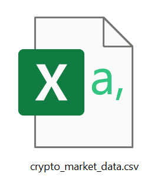
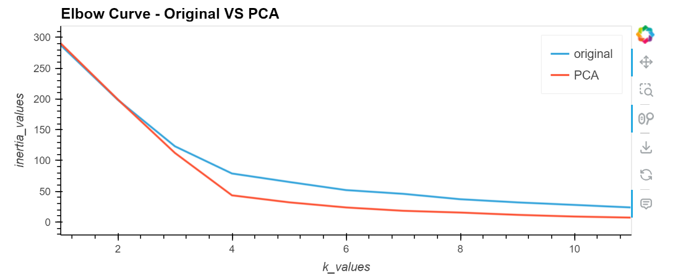
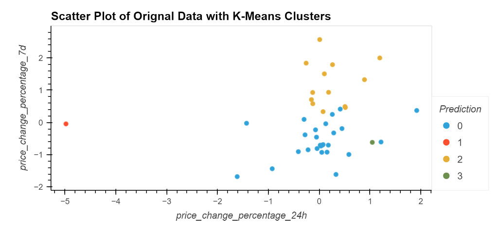
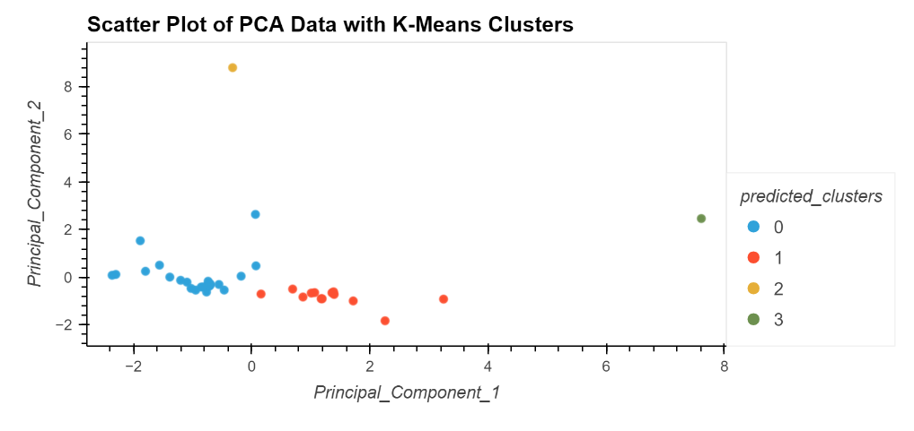

# CryptoClustering
 Cryptocurrency clustering is the process of categorizing cryptocurrencies into groups based on shared characteristics or features, aiming to reveal patterns and similarities within the cryptocurrency market.

### CyrptoClustering Unsupervised Machine Learning

Hi, let's find out out optimized clusters through implementation of elbow method, K-means and PCA algorithms.

### 1 Introduction 

The objective of the Cryptoclustering project is to employ unsupervised learning, particularly K-means clustering, to forecast whether cryptocurrencies exhibit influence from 24-hour or 7-day price variations. 

Furthermore, the project investigates the implications of dimensionality reduction through Principal Component Analysis (PCA) on the clustering outcomes.

Through innovative data analysis and visualization techniques, Cryptoclustering aims to provide valuable insights, aiding investors, analysts, and researchers in navigating the complexities of the ever-evolving cryptocurrency landscape.

### 2 Prerequisites

Before you begin, ensure you have the following installed:

Python (version 3.9 or later)

Jupyter Notebooks

Python libraries ( pandas, scikit-learn, matplotlib, seaborn )

### 3 Data Source

### 4 How it Works 

- Prepare the data with StandardScaler() module from scikit-learn to normalize the data from the CSV file.

- Determine the optimal value for k using the elbow method.

- Apply K-means clustering to the original scaled data.

- Conduct Principal Component Analysis (PCA) to reduce features to three principal components.

- Identify the optimal k value using the PCA-transformed data.

- Apply K-means clustering on cryptocurrencies using the PCA-transformed data.

- Visualize and compare the clustering results using hvPlot.

### 5 How Data Elbow Cuves and Clustering Shown 

When apply PCA, our elbow curve is similar to the original data and gives us the same value of k=4 . 

Also, after applying PCA, the clusters grouping are much clear than the origninal data.

### 6 Conclusion

The clustering project reveals distinct cryptocurrency clusters, affirms the efficacy of dimensionality reduction via PCA, and suggests actionable insights for market understanding and investment strategies.

## Author

## [Maira Syed GitHub](https://github.com/mairasyed)

 
